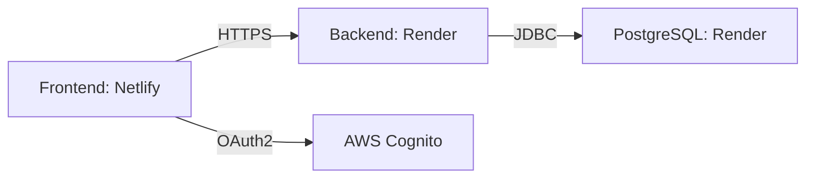

# JavaInHire - Design Document  
*Version:* 1.0  
*Last Updated:* 2025-06-21  
*Authors:* Collins HAYA  

---

## 1. Problem Statement  
### Primary Purpose  
JavaInHire addresses the fragmented job search experience for *entry-to-mid-level Java developers* by aggregating and curating relevant job postings from multiple RSS feeds (RemoteOK, WeWorkRemotely, Empllo) into a unified platform.  

### Key Challenges  
- Job seekers waste time filtering irrelevant postings on generic platforms.  
- Lack of specialized platforms for Java developers with <4 years of experience.  
- Manual tracking of applications is error-prone.  

### Target Users  
- Junior Java developers (0–2 years of experience).  
- Coding bootcamp graduates.  
- Career switchers targeting Java roles.  

### Value Proposition  
- *Pre-filtered Java jobs* (saves 70% search time).  
- *Experience-level tagging* (Junior/Intermediate).  
- *Application tracker* with status management.  

---

# 2. Use Cas  

## UC-1: User Views Job Listing  
*Actor:* Job Seeker  
*Preconditions:* User is authenticated via Cognito.  
*Success Flow:*  
1. User opens `/dashboard`.  
2. System fetches paginated offers from `/api/offers?page=0`.  
3. Frontend renders 10 offers with title, description, and "Favorite" button. Exception  
- No jobs found → Show empty state UI.  
- API timeout → Retry ×2, then show error.  

## UC-2: User Marks Offer as Favoris  
*Actor:* Job Seeker  
*Preconditions:* User is logged in; offer exists.  
*Success Flow:*  
1. User clicks "❤️ Favorite" on an offer.  
2. Frontend calls `POST /api/offers/{id}/favorite`.  
3. Backend updates `is_favorite=true` in PostgreSQL.  
*Exceptions:*  
- Unauthenticated → Redirect to login.  

## UC-3: Admin Fetches New Job  
*Actor:* System (Scheduled Task)  
*Preconditions:* AWS Lambda runs hourly.  
*Success Flow:*  
1. Cron triggers `RssFeedService.fetchAndSaveOffers()`.  
2. System parses RSS feeds and saves new jobs to PostgreSQL.  

---

# 3. API Design  

| *Endpoint*                | *Method* | *Description*                          |  
|-----------------------------|------------|------------------------------------------|  
| `GET /api/offers`           | GET        | Paginated offers (page, size params)     |  
| `POST /api/offers/{id}/favorite` | POST   | Toggle favorite status                   |  
| `GET /api/applications`     | GET        | List user’s applications (JWT required)  |  

*Example Request:*  
```http
GET /api/offers?page=0 HTTP/1.1
Host: javainhire-backend.onrender.com
Authorization: Bearer <JWT>
```

*Example Response:*  
```json
{
  "content": [
    {
      "offerID": 1,
      "title": "Junior Java Developer",
      "source": "WeWorkRemotely",
      "isFavorite": false
    }
  ],
  "totalPages": 5
}
```

---

# 4. Database Design  
## PostgreSQL Schema (Render) 
*Table: `offers`*  
| Column             | Type      | Description                     |  
|--------------------|-----------|---------------------------------|  
| `offer_id` (PK)    | SERIAL    | Auto-incremented ID             |  
| `title`            | VARCHAR   | Job title                       |  
| `source`           | VARCHAR   | "RemoteOK", "Empllo", etc.      |  
| `is_favorite`      | BOOLEAN   | Default: `false`                |  

*Table: `applications`*  
| Column             | Type      | Description                     |  
|--------------------|-----------|---------------------------------|  
| `application_id` (PK) | SERIAL | Unique ID                      |  
| `user_id` (FK)     | INTEGER   | Links to `users` table          |  
| `status`           | VARCHAR   | "Applied", "Interview", "Rejected" |  

---

# 5. Frontend Design  
### *Wireframes*  
*Dashboard Page:*  
```
[Header: JavaInHire Logo]  
[Search Bar]  
[Job Card 1] → Title, Source, ★ Favorite  
[Job Card 2]  
[Pagination: 1 2 3 Next]  
```

## Component Hierarchy  
```mermaid
componentDiagram
    App --> Header
    App --> JobList
    JobList --> JobCard
    JobList --> Pagination
```

## State Management  
- *Vanilla JS*: Global `currentPage` for pagination.  
- *DOM Manipulation*: `innerHTML` updates after API calls.  

---

# 6. Security  
- *Cognito JWT Validation*:  
  ```java
  @Bean
  SecurityFilterChain securityFilterChain(HttpSecurity http) throws Exception {
      http.authorizeRequests()
          .requestMatchers("/api/**").authenticated()
          .oauth2ResourceServer(oauth2 -> oauth2.jwt());
      return http.build();
  }
  ```
- *CORS Policy*:  
  ```properties
  # application.properties
  spring.webflux.cors.allowed-origins=https://dashboard-javainhire.netlify.app
  ```

---

# 7. Deployment  
##Infrastructure Diagr  


### Environment Variables  
| *Key*                     | *Value Example*              |  
|-----------------------------|--------------------------------|  
| `SPRING_DATASOURCE_URL`     | `jdbc:postgresql://render-db` |  
| `AWS_COGNITO_USER_POOL_ID`  | `us-east-1_XXXXX`             |  

---

## 8. Open Issues  
- *Rate Limiting*: Add Redis cache for RSS feed polling.  
- *Email Alerts*: Integrate AWS SES for new job notifications.  

---

**Approval**  
✅ *Reviewed by:* Collins HAYA  
📅 *Date:* 2025-06-21  

