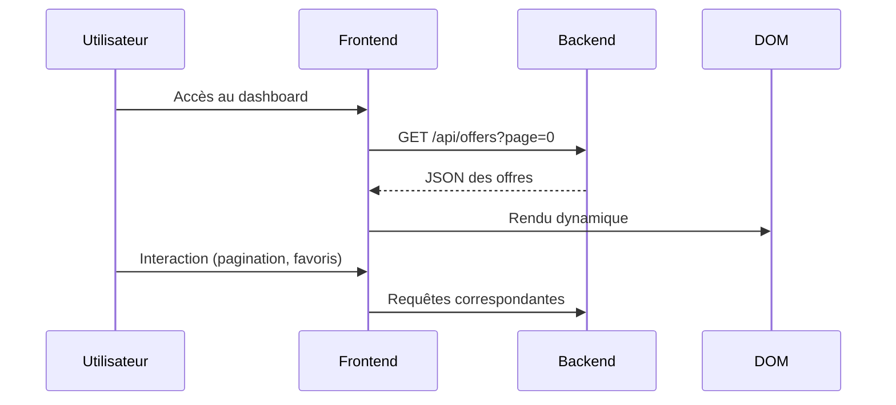
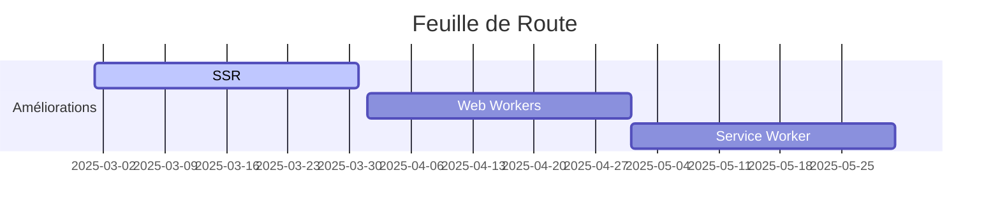

# **Documentation Technique du Dashboard JavaInHire**

## **📌 Table des Matières**
1. [**Aperçu Général**](#-aperçu-général)
2. [**Architecture Frontend**](#-architecture-frontend)
3. [**Structure du Code**](#-structure-du-code)
4. [**Fonctionnalités Clés**](#-fonctionnalités-clés)
5. [**Optimisations et Performances**](#-optimisations-et-performances)
6. [**Sécurité**](#-sécurité)
7. [**Compatibilité et Responsive Design**](#-compatibilité-et-responsive-design)
8. [**Intégration Backend**](#-intégration-backend)
9. [**Bonnes Pratiques de Développement**](#-bonnes-pratiques-de-développement)
10. [**Améliorations Futures**](#-améliorations-futures)

---

## **🌐 Aperçu Général**
Le dashboard JavaInHire est une interface utilisateur moderne et réactive permettant aux développeurs Java de:
- Consulter des offres d'emploi en temps réel
- Gérer leurs candidatures
- Marquer des offres en favoris
- Naviguer via une pagination fluide

**Caractéristiques techniques:**
- Single Page Application (SPA) sans framework
- Design responsive (mobile-first)
- Animations CSS performantes
- Chargement asynchrone des données
- Indicateurs visuels d'état

---

## **🏗 Architecture Frontend**
### **Structure des Fichiers**
```
frontend/
├── index.html          # Point d'entrée principal
├── styles.css          # Feuille de style globale
├── script.js           # Logique applicative
└── assets/             # Ressources statiques
    ├── icons/          # Icônes et favicons
    └── fonts/          # Polices personnalisées
```

### **Flux de Données**


---

## **💻 Structure du Code**
### **HTML (index.html)**
```html
<!DOCTYPE html>
<html lang="fr">
<head>
    <!-- Métadonnées optimisées -->
    <meta charset="UTF-8">
    <meta name="viewport" content="width=device-width, initial-scale=1.0">
    
    <!-- Favicon multi-plateforme -->
    <link rel="icon" sizes="192x192" href="/img/OIP.jpeg">
    <link rel="shortcut icon" href="/img/OIP1.jpeg">
    
    <!-- Ressources externes -->
    <link rel="stylesheet" href="https://cdnjs.cloudflare.com/ajax/libs/font-awesome/6.0.0/css/all.min.css">
</head>
<body>
    <!-- Structure modulaire -->
    <div id="loader">...</div>
    <header>...</header>
    <main class="offers">...</main>
    <footer>...</footer>
    
    <!-- Chargement asynchrone -->
    <script src="script.js" defer></script>
</body>
</html>
```

### **CSS (styles.css)**
Principales caractéristiques:
- Variables CSS pour une maintenance simplifiée
- Design system cohérent
- Animations performantes (GPU accelerated)
- Media queries pour le responsive

**Exemple de composant:**
```css
.offer {
    background: var(--card-background);
    border-radius: 10px;
    padding: 1.5rem;
    box-shadow: 0 4px 6px rgba(0,0,0,0.1);
    transition: transform 0.3s, box-shadow 0.3s;
    animation: fadeIn 0.5s ease-out;
}

.offer:hover {
    transform: translateY(-5px);
    box-shadow: 0 6px 12px rgba(0,0,0,0.15);
}
```

### **JavaScript (script.js)**
Fonctionnalités implémentées:
1. **Gestion des états**: Pagination, chargement
2. **Communication API**: Fetch avec gestion d'erreurs
3. **UX avancée**: Loader animé, feedback visuel

**Exemple de fonction:**
```javascript
async function loadOffers(page) {
    try {
        showLoader();
        const response = await fetch(`https://javainhire-backend.onrender.com/api/offers?page=${page}`);
        
        if (!response.ok) throw new Error('Erreur réseau');
        
        const data = await response.json();
        renderOffers(data.content);
        updatePagination(data);
    } catch (error) {
        showError(error);
    } finally {
        hideLoader();
    }
}
```

---

## **✨ Fonctionnalités Clés**
### **1. Système de Pagination**
- Gestion d'état côté client
- Requêtes asynchrones
- Mise à jour dynamique du DOM

### **2. Gestion des Favoris**
- Persistance via API
- Feedback utilisateur immédiat
- Optimistic UI updates

### **3. Expérience de Chargement**
- Loader animé avec progression simulée
- Gestion des erreurs élégante
- Cache local pour les performances

---

## **⚡ Optimisations et Performances**
| **Technique**               | **Implémentation**                          | **Impact**                      |
|-----------------------------|--------------------------------------------|---------------------------------|
| **Chargement différé**      | `defer` pour les scripts                   | Améliore le LCP                 |
| **CSS critique**            | Inline des styles essentiels               | Réduit le FOUC                  |
| **Cache HTTP**              | Headers appropriés sur le backend          | Réduit les requêtes réseau      |
| **Compression**             | Gzip/Brotli via Netlify                    | Réduit la taille des assets     |
| **Lazy loading**            | Intersection Observer pour images          | Améliore le LCP                 |

---

## **🔒 Sécurité**
### **Mesures Implémentées**
1. **CORS restrictifs**: 
   ```javascript
   Access-Control-Allow-Origin: https://dashboard-javainhire.netlify.app
   ```
2. **Protection des données**:
   - Sanitization du HTML avant rendu
   - Validation des URLs externes

3. **Sécurité des formulaires**:
   - Tokens CSRF (à implémenter)
   - Headers de sécurité CSP

---

## **📱 Compatibilité et Responsive Design**
### **Points de Rupture**
```css
/* Mobile (par défaut) */
.container { width: 95%; }

/* Tablette */
@media (min-width: 768px) {
    #offers-list { grid-template-columns: repeat(2, 1fr); }
}

/* Desktop */
@media (min-width: 1024px) {
    #offers-list { grid-template-columns: repeat(3, 1fr); }
}
```

### **Navigateurs Supportés**
- Chrome (dernière version)
- Firefox (dernière version)
- Safari (dernière version)
- Edge (dernière version)

---

## **🔌 Intégration Backend**
### **Endpoints Consommés**
| **Endpoint**                     | **Méthode** | **Description**                  |
|----------------------------------|------------|----------------------------------|
| `/api/offers?page={page}`        | GET        | Récupération paginée des offres  |
| `/api/offers/{id}/favorite`      | POST       | Marquage d'une offre en favori   |

### **Exemple de Payload**
```json
{
    "content": [
        {
            "offerID": 1,
            "title": "Développeur Java Junior",
            "description": "Description de l'offre...",
            "source": "Empllo",
            "link": "https://empllo.com/offres/123"
        }
    ],
    "pageable": {
        "pageNumber": 0,
        "totalPages": 5
    }
}
```

---

## **🏆 Bonnes Pratiques de Développement**
### **Code Qualité**
- Validation HTML via W3C Validator
- CSS organisé en méthodologie BEM
- JavaScript modulaire

### **Outils Recommandés**
- ESLint (configuration airbnb)
- Prettier (formatage cohérent)
- Lighthouse (audit de performance)

### **Patterns Utilisés**
- Observer pattern pour les événements UI
- Factory pattern pour la création d'éléments DOM
- Async/Await pour la gestion des promesses

---

## **🚀 Améliorations Futures**
1. **SSR (Server-Side Rendering)**: Pour améliorer le SEO
2. **Web Workers**: Pour le traitement hors UI thread
3. **Service Worker**: Pour une expérience offline
4. **WebSockets**: Mises à jour en temps réel
5. **Analytics**: Suivi des interactions utilisateurs



---

**License**: MIT  
**Version**: 1.0.0  
**Dernière Mise à Jour**: Avril 2025

Ce document reste vivant et sera mis à jour en fonction de l'évolution du projet. Pour toute contribution, merci d'ouvrir une issue sur le dépôt GitHub.
